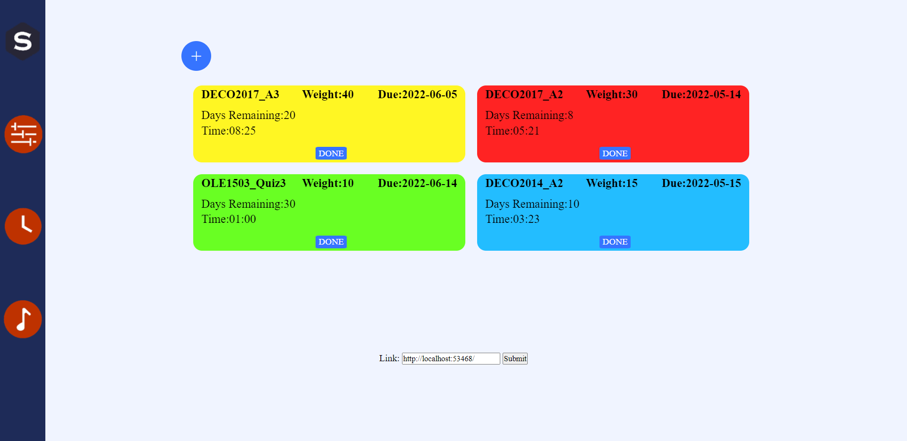
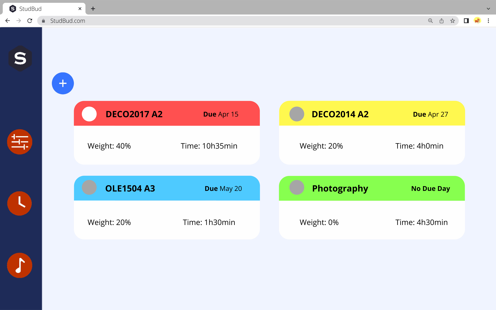
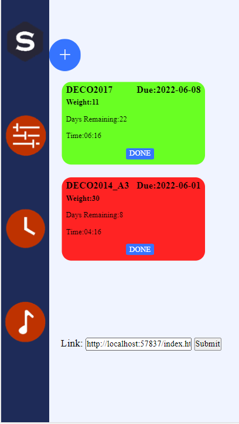
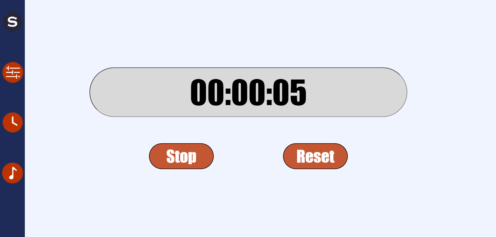
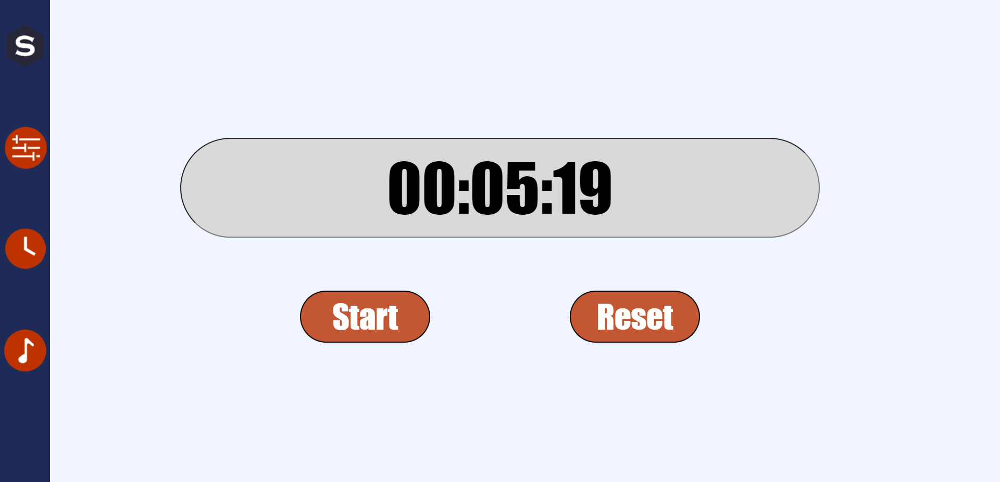
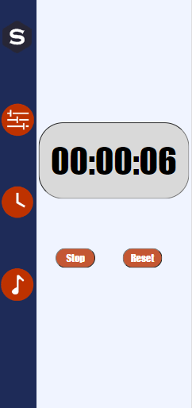
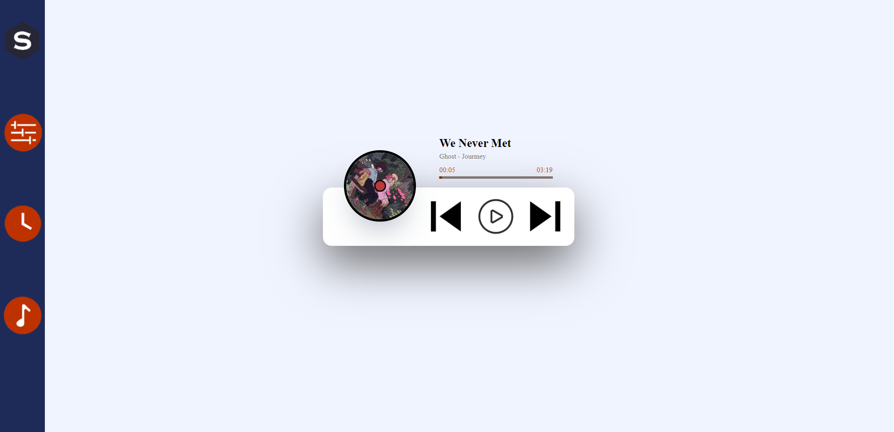

# studbud
## Flow Chat

### The menu can move to any page.
* The logo link to task page.
* Next one link to Flow Time Tracker page.
* The clock link to Stopwatch Timer page.
* Last one link to Music Player page.

It makes the page comfotable when user use it.

## Task Page



### Covey Quadrants
I restored the design drawing as much as possible.For the color, I used Covey Quadrants.
* red for important and urgent
* yellow for important not urgent
* blue is not important but urgent
* green is not important and not urgent

I used weight data for important. If weight > 25, it's mean important. Day Remaining for urgent, if Day Remaining < 15, it's mean urgent.
```js
if (task.weight > 25 && task.days < 15){
     // important and urgent is red;
      item.style.backgroundColor = '#FF2323 ';
    }else if (task.weight > 25 && task.days > 15){
      //important NOT urgent is yellow
      item.style.backgroundColor = '#FFF623 ';
    }
    else if (task.weight < 25 && task.days > 15){
      //not important not urgent is green
      item.style.backgroundColor = '#69FF23';
    }else{
      //not important and urgent is blue
      item.style.backgroundColor = '#23BDFF';
    }
```
### Add Task
Users can add task, Due Date, Weight, Days remaining and Estimated Completion Time in the task board. 

### Acronym Maker
Click submit will have the link of Acronym Maker

### Phone

I changed the task list one in a row. It looks better.
```css
@media  (max-width: 450px) {
  #menu{
    width: 20vw;
  }  
  li{
      width: 60vw;
    }
    ...
}
```
## Flow Time Tracker

## Stopwatch Timer

I didn't design this page in A2, then I know we should have a stopwatch timer.

The stopwatch timer has samiliar design with flow Time Timer. The point is over 9 Ten digits plus 1. 60second = 1 minute, 60minuts = 1hour.
### stop and start

If click stop, the time will stop and button change to start. Click start the time will start and button change to stop.
```js
//the start and stop
function pause(self) {
 var state = self.getAttribute("state");
// set a on or off, on will start, off will stop
 if (state === "on") {
  clearInterval(n_timer);
  self.textContent = "Start";
  self.setAttribute("state", "off");
 } else {
  n_timer = timer();
  self.textContent = "Stop";
  self.setAttribute("state", "on");
 }
}
```
### Reset
click reset the time will be 00:00:00 
```js
// restart
function restart() {
 clearInterval(n_timer);
 // set on 0 when press restart
 nSecond = 0;
 nMinute = 0;
 nHour = 0;
 n_timer = timer();
 ele_pause.textContent = "Stop";
 ele_pause.setAttribute("state", "on");
}
```
### Phone

I changed the size when width less than 450 (phone size)

## Music Player


It is differnt with my design. Because I find a video the music player looks much better when I make the page.
* https://www.bilibili.com/video/BV1di4y127U2?spm_id_from=333.999.0.0/

Through learning and improving, add some own elements, such as black and red in the center, seem to play on old-fashioned discs.
### Play and Change Song
```js
  if(playingMusic == "Are You Lost") {
            audio.src = new URL('../music/areYouLost.mp3', import.meta.url);
            }
            else if (playingMusic == "月光の雲海") {
            audio.src = new URL('../music/tianKong.mp3', import.meta.url);
            }
            else if (playingMusic == "I Need You") {
                audio.src = new URL('../music/iNeedYou.mp3', import.meta.url);
                }
            else if (playingMusic == "The Way I With You") {
            audio.src = new URL('../music/theWay.mp3', import.meta.url);
            }
            else if (playingMusic == "We Never Met") {
                audio.src = new URL('../music/weNeverMet.mp3', import.meta.url);
                }
            else if (playingMusic == "夏の夜") {
            audio.src = new URL('../music/xiaYe.mp3', import.meta.url);
            }  
```
I have a array of the song name, when change to the sone name, it will url the Matching song.
